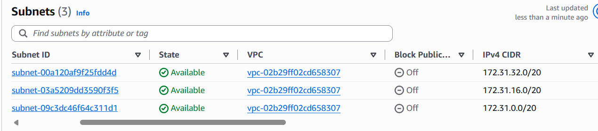
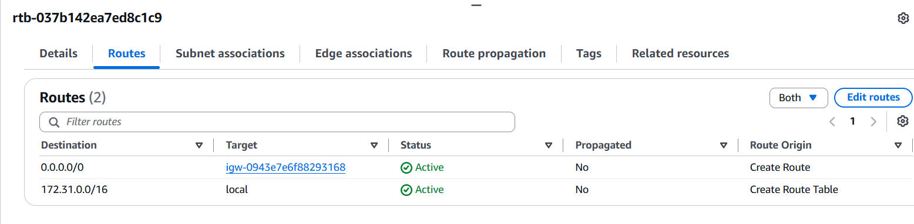
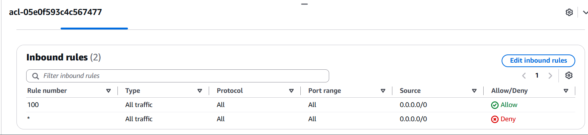
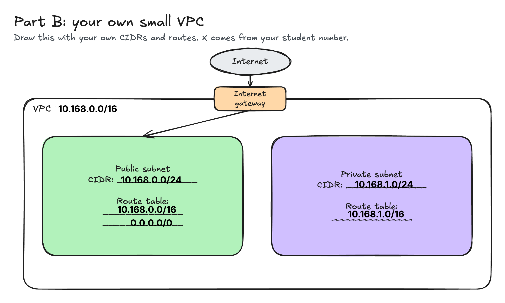

# Assignment 2 Submission

<!--
How to use this template:

1. Copy this file to submissions/assignment-2/<your-github-username>/submission.md
2. Replace every answer placeholder with your own answer. Delete the angle brackets too.
3. Save your four images in the same folder, with the exact file names below.
4. Do not write your full name or your student number in this file.
-->

## About me

- GitHub username: GlorianaSkye
- Section: IV-CCSAD
- IAM user name that I signed in with: ccsad-g05
- X: 168

---

## Part A. Explore

### A1. The VPC

Default VPC IPv4 CIDR:

172.31.0.0/16

Number of addresses in that CIDR:

65,536

### A2. The subnets

| Availability Zone | IPv4 CIDR |
| --- | --- |
| apse1-az2(ap-southeast-1a) | 172.31.32.0/20 |
| apse1-az1(ap-southeast-1b) | 172.31.16.0/20 |
| apse1-az3(ap-southeast-1c) | 172.31.0.0/20 |

Screenshot 1. Save it as `screenshot-1-subnets.png` in your folder. The image line below shows it.

### A3. Available addresses

Available IPv4 addresses in each subnet:

4,091

Why is the number lower than 4,096?

The cloud providers reserve 5 specific IP addresses in every subnet for core networking and management. For AWS, these reserved IP addresses are the network address which is the first IP address in the CIDR block, the VPC router which is the second IP address used as the default gateway, the DNS server, an address reserved by AWS for future features, and the last IP address in the CIDR block which is used for supporting broadcast traffic. 

What uses the missing address in the subnet with the lowest number?

If one subnet shows an even lower available count than the others, it means that the additional address has been used by an active resource or explicit rule. This can be caused by different factors such as active resources like an EC2 instance or ECS task and load balancer nodes like Application Load Balancers or Network Load Balancers have noders that are configured in that subnet's Availability Zone. 

### A4. The route table

| Destination | Target |
| --- | --- |
| 0.0.0.0/0 | igw-0943e7e6f88293168 |
| 172.31.0.0/16 | local |

Screenshot 2. Save it as `screenshot-2-routes.png` in your folder. The image line below shows it.

### A5. Public or private

Are the default subnets public or private? Which route proves it?

The default subnets are public. The route 0.0.0.0/0 points to an Internet Gateway which proves that the subnet is public. An Internet Gateway is a component that allows communication between instances in my VPC and the public internet. Because traffic is intended for the outside world by being explicitly routed to the Internet Gateway, the resources in this subnet can send and recieve traffic over the public internet. 

### A6. The internet gateway

State of the internet gateway:

Attached

What happens to the default subnets if the gateway is detached?

If the gateway is detached, the subnets would immediately lose all connectivity to and from the public internet. Resources such as EC2 instances can no longer reach external websites or be accessed from the outside world. 

### A7. NAT gateways

Number of NAT gateways:

0 (No NAT Gateways)

Can a server in a new private subnet download updates? Why?

No, a server in a new private subnet cannot download updates. A private subnet does not have a route to an Internet Gateway. If there is a NAT Gateway, a server in a private subnet can initiate outbound traffic to the internet. But since there is zero NAT gateways in this VPC, this cannot be possible.

### A8. The network ACL

| Rule number | Source | Allow or Deny |
| --- | --- | --- |
| 100 | 0.0.0.0/0 | Allow |
| * | 0.0.0.0/0 | Deny |

How is a network ACL different from a security group?

Security groups operate at the instance level and automatically allow return traffic, whereas Network ACLs operate at the subnet level and require explicit rules for both inbound and outbound traffic.

Screenshot 3. Save it as `screenshot-3-network-acl.png` in your folder. The image line below shows it.

### A9. The default security group

Inbound rule (type and source):

HTTP abd 0.0.0.0/0

Which resources can send traffic to an instance that uses it?

Any device or resource located on the public internet which is 0.0.0.0/0 can send HTTP traffic to the instance.

---

## Part B. Prepare

### B1. Plan two subnets

- Public subnet CIDR: 10.168.0.0/24
- Private subnet CIDR: 10.168.1.0/24

### B2. Route tables

Route table of the public subnet:

| Destination | Target |
| --- | --- |
| 10.168.0.0/16 | local |
| 0.0.0.0/0 | igw-... (Internet Gateway) |

Route table of the private subnet:

| Destination | Target |
| --- | --- |
| 10.168.1.0/16 | local |

### B3. My VPC diagram

Tool used (Excalidraw, draw.io, Lucidchart, or paper):

Lucidchart

Save your diagram as `vpc-diagram.png` in your folder. The image line below shows it.

### B4. Predict a change

Can you still open the web page from your laptop? Why?

No. When deleting 0.0.0.0/0 route, it removes the path to the Internet Gateway which makes it impossible for any external internet traffic to reach my instance's public IP address.

Can the instance still reach another instance in the VPC? Why?

Yes. The internal communication within the VPC relies on the local route which will remain unaffected by the removal of the internet route.

### B5. Place a database

Which subnet gets the database? Why?

The subnet that should get a database should be the private subnet. Databases store sensitive data and have no requirement for direct public internet access. Placing it in a private subnet protects it from potential attacks while allowing internal application servers in the VPC to communicate with it.

### B6. My question about VPCs

What is your question, and what made you think of it?

If there are scenarios where there are overlapping or conflicting state route entries, how does AWS Route Tables handle it especially if there was a route that is more specific than the default local route? I was wondering if AWS enforces deterministic rule order like in traditional networking routers or if there are specific restrictions that apply inside a VPC route table. 